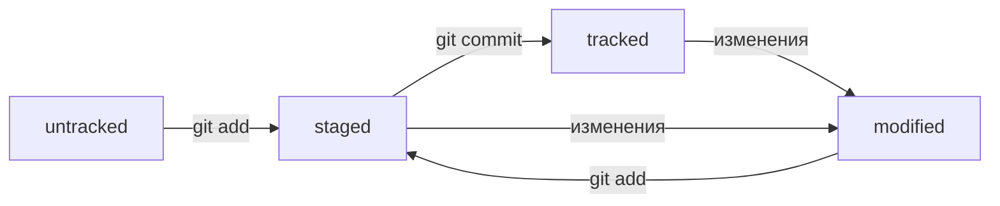

# Основы `git`

Это небольшое руководство и шпаргалка по `git`, собранное из курса [Основы Git](https://practicum.yandex.ru/git-basics/)

# Перед началом

Чтобы освоить `git` все-таки хорошо знать командную строку. Если такие команды как `touch`, `ls`, `rm`, `cd` вызывают в вас чувство недоумения и ужас, то стоит попробовать свои силы в командной оболочке, тут может помочь эта [статья](https://habr.com/ru/articles/501442/)

В конце концов `git` это консольная команда, работает без графического интерфейса. И чтобы научиться ей пользоваться, вам надо уметь запускать саму консоль и в ней ориентироваться, иначе все дальнейшее изложение покажется вам билебердой.

> Пользуйтесь клавишей `TAB` —  она поможет дозаполнить пути, и флаги 

# Система контроля версий. Что такое `git`

Глеб написал хорошую статью, а ночью словил приступ ненависти к себе и всю ее переписал. Утром эту статью перечитал друг, и сказал, что раньше было лучше. Как откатиться к прошлой версии. Что там было? Может быть у кото-то в месседжере сохранилась часть. Остальное можно дописать. Глеб в ужасе. 

Такой проблемы не возникло бы, если бы Глеб пользовался системой контроля версий. Тогда бы у него был бы список изменений статьи с самого старта до последней версии. И если что мог бы откатиться. 

> Например, те же Яндекс.Документы имеют встроенную систему контроля версий.

`git` это система контроля версий. Это программа которая запоминает версии ваших файлов. И знает различия между этими версиями, может если что откатить файл к нужной версии.

Системы контроля версий очень хорошо прижились в программировании, потому что не просто позволяют программистам откатываться к прошлым версиям своих проектов, но и работать совместно над кодом.

Дело в том, что система контроля версий запоминает какие кусочки файлов были изменены, и потом может собрать итоговый файл от Глеба и Стаса, учитывая все их правки. Даже если никто из них еще не видел все правки вместе. А если возникнет конфликт правок, то поможет его опознать и разрешить. 

> Ко всему прочему `git` помогает осмысленно программировать. К каждому `коммиту`, коммиту требуется сопроводительное сообщение. Что сейчас было изменено. На первых порах очень сложно описать: а что я сейчас сделал в коде. Со временем становится проще, да и сам начинаешь понимать, что именно делаешь лучше.

# Основые команды

## Создание репозитория `git init`

Чтобы создать репозитой нужно в папке выполнить команду `git init`. Имейте в виду, что репозиторий охватывает ту папку в которой он был создан, и на все подкаталоги. Так что создавайте репозиторий в самой старшей папке текущего проекта. 

Это одна из самых редких команд. После создания в папке появится скрытая папка `.git`, в которой будет храниться вся служебная информация о репозитории. 

> Не стоит заводить вложенные репозитории, это может свести с ума git

Если нужно отменить репозиторий, нужно удалить папку `.git`

```bash
rm -rf .git
```

После этого вся информация о коммитах пропадет

## git status

Эта команда используется, чтобы узнать текущий статус файлов в репозитории:
+ Инициализирован ли репозиторий
+ какая ветвь активна
+ Какие файлы отслеживаются
+ какие будут добавлены в коммит
+ а какие не будут
 — вот на такие вопросы поможет ответить `git status`

 ```bash
On branch master // ветвь называется master
Your branch is up to date with 'origin/master'. // синхронизирована с удаленным репозиторием

Changes not staged for commit: // изменения, которые не войдут в коммит
  (use "git add <file>..." to update what will be committed) // подсказки
  (use "git restore <file>..." to discard changes in working directory)
        modified:   README.md // вот этот файл, что вы читаете изменен, но в коммит не добавлен пока

no changes added to commit (use "git add" and/or "git commit -a") // содержание коммита
 ```

А если, например, запустить в каталоге, в котором нет репозитория получим вот такое сообщения об ошибке

```bash
fatal: not a git repository (or any of the parent directories): .git
```

## Изменения и коммиты

## Добавление файла `git add`

Чтобы подготовить файл или папку к оправке в репозиторий, нужно воспользоваться коммандой `git add`, например

```bash
git add README.md
```

Ещё можно вопспользоваться командой `git add --all`, тогда к отправке будут подготовленны все измененные с последнего коммита файлы.

Говорят файл **добавлен в индекс**, что означает подготовлен в отправке. Я не просто так использую этот термин. По сути команда `add` ещё не запоминает файлы, она их просто собирает, а чтобы сфотографировать и запомнить изменение, нужно воспользоваться следующей командой

## git commit

Если `git add` приглашала всех людей встать в кадр фотоаппарата, то `git commit` уже большая белая "сделать фотографию".

```bash
git commit -m "Сообщение"
```

После запуска этой команды `git` запомнит изменения, сделанные в проекте (когда, кем, и где) и к ним впоследствии можно будет вернуться. Изменения запоминаются как бы кусочками, не просто прошлая версия файла и новая, а где в старом файле были сделаны изменения: какая строка удалена, какая добавлена.

Самая распространенная ошибка при попытке коммита, это забыть добавить файлы в индекс(подготовить к коммиту), тогда коммит не получится. А в целом можно пользоваться командой

```bash
git commint -am "Сообщение"
```

Она добавит все файлы из текущей директории в индекс, и нажмет за затвор фотоаппарата. 

Сообщение - очень важная часть коммита, она позволяет быстро посмотреть какие изменения сделаны, когда и кем, о чем мы можем убедиться, запустив следующую команду

## git log

Показывает последние правки в репозитории. 

```bash
git log
```

На выходе мы получаем список коммитов и сообщений к ним, и ещё важную инфу

```bash
commit 23cb3aa087bec2a830e2319ac54eaf41b9a18316 (HEAD -> master)
Author: Frolenko Dima <mail@frolenkodima.ru>
Date:   Wed Aug 23 08:12:57 2023 +0300

    Добавлено описание команд add и commit в ридми

commit 180f1a29bef81d7b3468ee63423e4eb67ba0210a (origin/master, origin/HEAD)
Author: Frolenko Dima <mail@frolenkodima.ru>
Date:   Tue Aug 22 20:34:25 2023 +0300

    Добавить главку о git status

commit bda9f7de743ca0dfe2c85d08e93187b985837c39
Author: frol <mail@frolenkodima.ru>
Date:   Mon Aug 21 16:04:30 2023 +0300

    Добавил забытые комманды. Как много я знаю оказывается!

commit 14865c3c767814a36ea24b4f1de606f2a17743d0
Author: frol <mail@frolenkodima.ru>
Date:   Mon Aug 21 16:02:04 2023 +0300

    Набросал каркас
```

По центру мы видим сообщение в коммите, это очень важная часть коммита. Ведь изначально хоть тут хоть на гитхабе мы видим только его, и дальше решаем, стоит ли нам залезать глубже в этот коммит и смотреть какие там изменения сделаны или нет. Например, если у меня перестала работать связь с базой данных, я не полезу в коммит с сообщением "Поправил главу о требованиях в описании". Это сэкономит время

О правилах хорошего тона в репозиториях читайте в главе "Правила хорошего тона"

Рассмотрим подближе вывод одного сообщения

```bash
commit 23cb3aa087bec2a830e2319ac54eaf41b9a18316 (HEAD -> master)
Author: Frolenko Dima <mail@frolenkodima.ru>
Date:   Wed Aug 23 08:12:57 2023 +0300

    Добавлено описание команд add и commit в ридми
```

После слова коммит идёт куча символов `23cb3aa087bec2a830e2319ac54eaf41b9a18316`, это хеш коммита, его идентификационный номер. Он уникален и по нему можно точно определить коммит

`(HEAD -> master)` означает, что это головной коммит, самый свежий. Ключевое слово `HEAD` можно использовать вместо хеша, чтобы указать на самый свежий коммит. Мастер это имя ветки(про ветки читай раздел `git branch`)

В поле `Author` написанны данные автора, а в поле `Date` дата коммита

Есть так же сокращенная версия вывода

```
git log --oneline
```
Где мы получим:

```bash
7a70c67 (HEAD -> master, origin/master, origin/HEAD) Добавлена комманда git log в описание, и незначительные правки по тексту
23cb3aa Добавлено описание команд add и commit в ридми
180f1a2 Добавить главку о git status
```

+ `7a70c67` - это сокращенный хеш, им можно пользоваться как обычным длинным хешем
+ `HEAD` -> master, origin/master, origin/HEAD — ветки с изменениями,
+ и далее сообщение коммита

## Статусы файлов

После инициализации репозитория файлы могут находиться в четырех статусах:

    + `untracked` — пока не добавлен в репозиторий, не отслеживается
    + `tracked` — отслеживаются изменения
    + `modified` — был изменен с момента коммита, или добавления в индекс
    + `staged` — добавлен в индекс(подготовлен для коммита)

Кроме первого случая возможны пересечения.

Изначально созданный файл лежит просто так, и git на него не обращает особого внимания. Такой файл `untracked`. После того, как мы добавили файл командой `git add` он становится  `staged`(выбран для коммита, пришлашен на фотографию). После коммита, он станет `tracked`. Изменим его, он становится `modified`, а если его добавить в коммит, то он становится `staged`, причем `modified` с него снимается. Если после того, как мы уже подготовили файл `staged`, изменим его, то он получит статус `modified`. Таким образом будет иметь все три статуса, кроме `untracked`. В таком случае не все изменения войдут в коммит, какие-то останутся для следуюещего раза. Это бывает иногда удобно. 

Математику статусов можно было бы изобразить вот так

`modified`+`git add` = `staged`
`untracked` + `git add` = `staged`
`staged` + `git commit` = `tracked`
`modified` + `git commit` = `modified` // изменения не добавлены в индекс, это нужно дополнительно сделать командой `git add`
`untracked` + `git commit` = `untracked`

Жизненный цикл файла в репозитории можно было бы изобразить вот так



# Удаленные репозитории

То, что делаешь у себя папке все это хранится локально, и только на одном компе. Это и не очень надежно, и не очень практично. А нам хотелось бы, чтобы:

+ Код был доступен на каждом компьютере
+ Код был сохранен на каком-то общем сервере
+ Можно было бы поделиться кодом

В этом нам поможет удаленные репозитории `git remote`. Помимо нашей локальной машины, мы можем держать главный репозиторий на сервере. И загружать туда свои правки, и получать чужие.

### Github

В интернете есть несколько сервисов, которые предоставляют место для удаленного репозитория. Один из них github, собсно сейчас вы тут и находитесь. Помимо самого репозитория, тут много инструметов для работы с ним и социального взаимодействия. Так что в дальнейшем все примеры будут взаимодействовать именно с Гитхабом

## SSH

> Вася держит свой проект на сервере, и не хочет чтобы кто-то ещё мог его редактировать

> Даша и Лена работают над совместным проектом, но не хотят чтобы туда мог вносить правки кто-то ещё

Когда дело начинает касаться общественных пространств, нам понадобится какая-то защита. И по крайней мере способ идентификации, чтобы на нужные репозитории заходили только определенные люди.

В этом нам поможет `ssh` — протокол безопасной обочки. Он позволит в условиях интернета идентифицироваться на серверах и работать с ними. 

Тут нужно раз сформировать ключи шифрования командой `ssh-generate`

```bash
ssh-keygen -t ed25519 -C "your_email@example.com"
```

Подставьте вашу почту в поле, и у вас в домашней папке появится ваш ключ в особой папке `.ssh`. Загрузите этот ключ в личный кабинет github и пользуйтесь вашими удаленными репозиториями. 

Разобраться поможет [статья на хабре](https://habr.com/ru/articles/755036/)

## Добавление удаленного репозитория `git add remote`

Чтобы добавить удаленный репозиторий надо воспользоваться коммандой 

```bash
git add remote имя_репозитория ссылка_на_репозиторий
```

В случае этого репозитория выглядит вот так

```bash
git add remote origin https://github.com/thefrol/git-basics-doc
```

`origin` в данном случае традиционное название для главного репозитория, а их может быть не один.

Теперь мы привязали репозиторий, а чтобы отправить в него наши правки, воспользуемся слудующей коммандой

## Отправка `git push`

При первом запуске надо связать ветку и репозиторий

```bash
git push -u origin main
```

+ `origin` — имя удаленного репозитория, это имя мы указывали в команде `git add remote`
+ `main` — имя отправляемой ветки. Если не получается отправить `main` можно попробовать `master`, а вообще имя ветки можно посмотреть командой `git status`

А потом каждый раз, когда хотите отправить коммиты, просто вводить

```bash
git push
```

Конечно, чтобы что-то отправить нужно локально создать коммиты, а потом их уже отправлять. Изменения без коммита на сервер не отправятся

## Посмотреть привязанные репозитории `git remote -v`

Чтобы узнать какие репозитории уже подлючены в этом проекте введите 

```bash
git remote -v
```

И вот вывод

```bash
origin  https://github.com/thefrol/git-basics-doc.git (fetch)
origin  https://github.com/thefrol/git-basics-doc.git (push)
```


# Правила хорошего тона


## README.md


## Сообщения коммитов

Хорошее сообщение содержит информацию о том _что и где_ было изменено.

Плохое сообщение "Добавил забытые комманды. Как много я знаю оказывается!"

Есть несколько разных соглашений о том, как писать коммиты. С одним можно ознакомиться на [официальном сайте](https://www.conventionalcommits.org/ru/v1.0.0/). Какой пользоваться вам подскажут в вашей команде. 

# Автор

Гайд был написан Дмитрием Фроленко, августовскими вечерами 2023 г на диване